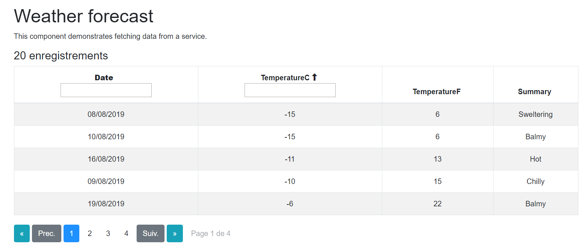
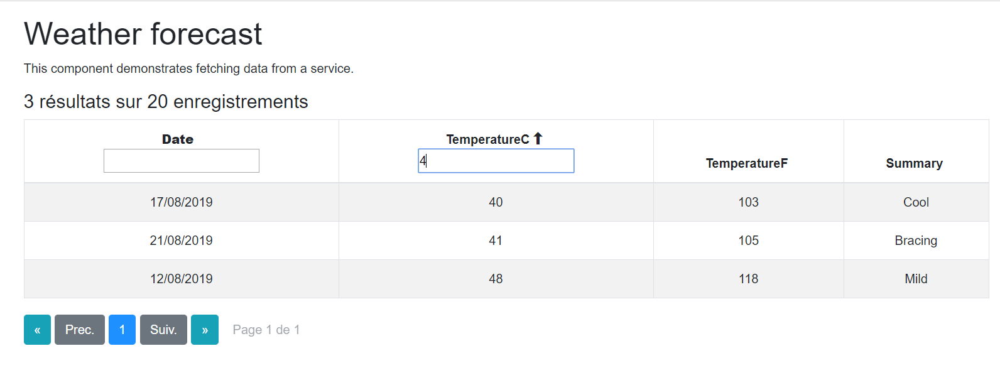

[](LICENSE)
[](https://www.nuget.org/packages/BlazorDataGrid/)

[Read in english](BlazorDatagrid.en.md)

__Attention, la version 3.0.0 introduit des changements par rapport à la version précédente qui nécessite de revoir l'implémentation dans vos programmes.__

# BlazorDatagrid

Il s'agit d'un composant pour Blazor. Une datagrid avec pagination, filtre et la possiblité de trier la colonnes par ordre croissant ou décroissant.

# Nuget Gallery
La paquet NuGet est disponible sur le site nuget.org à cette adresse https://www.nuget.org/packages/BlazorDataGrid/

# Installation

Ajouter le paquet NuGet à votre solution. 
```
Install-Package BlazorDataGrid -Version 4.1.0
```
Ou avec .Net CLI
```
dotnet add package BlazorDataGrid --version 4.1.0
```

Ensuite il faut ajouter dans le fichier ```_Imports.razor```
```
@using BlazorDataGrid
```

Et dans le fichier ```Startup.cs``` dans la méthode ```public void ConfigureServices(IServiceCollection services)```
```
services.AddScoped<AppState>();
```

# Paramètres

- **Le composant ```<BlazorDataGrid>``` accepte les paramètres suivant :**
    -	**Items** (obligatoire): La liste qui remplie la datagrid
    -	**PageSize** : Le nombre initial de résultat par page. S'il n'est pas présent, le nombre initial correspond a la première valeur du selecteur.
    -   **ShowTotalResult** : Un booléen pour afficher ou non le nombre de résultats
    -	**BlazorDataGridColumn** : Un composant permettant d'afficher les header
    -	**GridRow** : Les lignes de la datagrid
    - **Translation** : (optionnel) Un dictionnaire contenant la traduction de la datagrid. La [partie traduction](#Traduction) détail le contenu du dictionnaire.
    - **ShowPageSelector** : true ou false, affiche ou non le selecteur du nombre d'élément par page.
    - **PageSelector** : Un dictionnaire string int, qui permet de personaliser le sélecteur affichage/valeur. La valeur 0 correspond à tous les éléments. Par défaut l'affichage est le suivant :
        - "5", 5
        - "10", 10
        - "25", 25
        - "50", 50
        - "100", 100
        - "*", 0
    - **Editable** : true ou false, permet de rendre la datagrid éditable. Si le paramètre n'est pas présent, la datagrid n'est pas éditable.    

- **Le composant ```<BlazorDataGridColumn>``` accepte les paramètres suivant :**
    -	**DataGridColumn** : Le composant détaillant chaque header

- **Le composant ```<DataGridColumn>``` accepte les paramètres suivant :**
    -	**Items** (obligatoire): Il faut passer le même paramètre que pour le composant ```<BlazorDataGrid>```
    -	**ColumnName** : Le nom réel de la colonne sur laquelle se base le filtre et le tri
    -	**DisplayColumnName** : (non obligatoire) Le nom qui sera affiché dans le header. *Il est possible de passer le contenu du header entre les balises à la place*
    -	**Filter** : true ou false pour afficher ou non le champ filtre sur la colonne
    - **DropdownFilter** : true ou false. Remplace la zone de texte du filtre par une liste contenant toutes les valeurs différentes de la colonnes.

    - **Format** : Spécifie un format de date pour l'affichage.
    - **ReadOnly** : Permet de rendre une colonne non éditable lorsque la datagrid est éditable.

- **Le composant ```<GridRow>``` accepte les paramètres suivant :**
    - **Cell** : Le composant détaillant chaque cellule de la ligne.
- **Le composant ```Cell``` accepte les paramètres suivant :**
    - **Items** (obligatoire) : Il faut passer le même paramètre que pour le composant _BlazorDataGrid_
    - **Content** : Le contenue de la cellule. Le paramètre de la collection à afficher se place entre double accolade {{}}
    - **ValidationPattern** : Une expression régulière pour appliquer un contrôle sur la cellule.
    - **LabelError** : Le message à afficher en cas d'échec de la validation.

# Exemple d'utilisation

```
<BlazorDataGrid Items="@forecasts" ShowTotalResult="true" TheadClass="thead-dark" Translation="@translate"
                ShowPageSelector="true" PageSelector="@PageSelector" Editable="true" RowSelector="true">
    <BlazorDataGridColumn>
        <DataGridColumn Items="@forecasts" ColumnName="Date" Filter="true" Format="dd/MM/yyyy"><strong>Date</strong></DataGridColumn>
        <DataGridColumn Items="@forecasts" ColumnName="TemperatureC" DisplayColumnName="TemperatureC" Filter="true"></DataGridColumn>
        <DataGridColumn Items="@forecasts" ColumnName="TemperatureF" DisplayColumnName="TemperatureF" DropdownFilter="true" ReadOnly="true"></DataGridColumn>
        <DataGridColumn Items="@forecasts" ColumnName="Summary" DisplayColumnName="Summary" Filter="true"></DataGridColumn>
    </BlazorDataGridColumn>
    <GridRow>
        <Cell Items="@forecasts" Content="{{Date}}"/>
        <Cell Items="@forecasts" Content="<strong>{{TemperatureC}}</strong>" ValidationPattern="^[-]?\d+$" LabelError="@translate["labelError"]"/>
        <Cell Items="@forecasts" Content="{{TemperatureF}}" />
        <Cell Items="@forecasts" Content="{{Summary}}" />
    </GridRow>
</BlazorDataGrid>

private Dictionary<string, string> translate = new Dictionary<string, string>
    {
        {"next", "next" },
        {"previous", "Previous" },
        {"pages", "Page __curpage__ of __totalpages__" },
        {"totalresult", "__totalcount__ item" },
        {"totalresultplural", "__totalcount__ items"},
        {"filteredresults", "__filteredcount__ result of __totalcount__ items" },
        {"filteredresultsplural", "__filteredcount__ results of __totalcount__ items"  },
        {"selector", "Items per page"}
    };

private Dictionary<string, int> PageSelector = new Dictionary<string, int>
    {
        {"5", 5 },
        {"10", 10 },
        {"20", 20 },
        {"30", 30 },
        {"All", 0 }
    };
```

# Traduction
La traduction s'éffectue par l"intermédiaire d'un dictionnaire string string.
Les différentes valeur de clé sont les suivantes : 
> - **next** : le bouton page suivante de la pagination
> - **previous** : le bouton page précédente de la pagination
> - **pages** : La zone d'affichage de la page courrante et du nombre total de pages. Dans la partie valeur, il est possible de renseigner les variables suivante
>   - **```__curpage__```** : la page actuelle
>   - **```__totalpages__```** : le nombre totale de pages
> - **totalresult** : La phrase affiche le nombre total de résultats au singulier (0 ou 1 résultat). La partie valeur accepte la variable suivante : 
>   - **```__totalcount__```** : Le nombre total de résultats
> - **totalresultplural**: idem que le précédent mais au pluriel (2 résultats ou plus)
>   - **```__totalcount__```** : Le nombre total de résultats
> - **filteredresults** : permet l'affichage des résultats filtrés au singulier (0 ou 1 résultat).
>   - **```__filteredcount__```** : le nombre de résultats filtrés.
>   - **```__totalcount__```** : Le nombre total de résultats
> - **filteredresultsplural** : permet l'affichage des résultats filtrés au pluriel (2 résultats ou plus).
>   - **```__filteredcount__```** : le nombre de résultats filtrés.
>   - **```__totalcount__```** : Le nombre total de résultats
> - **selector** : Le text pour le nombre de résultats par page.
> - **loading** : Le message de chargement.
> - **labelError** : Le message d'erreur lorsqu'un format saisie dans la datagrid est incorect.

# Aperçu




**[Notes de version](BlazorDatagrid_RELEASE_NOTE.md)** 

